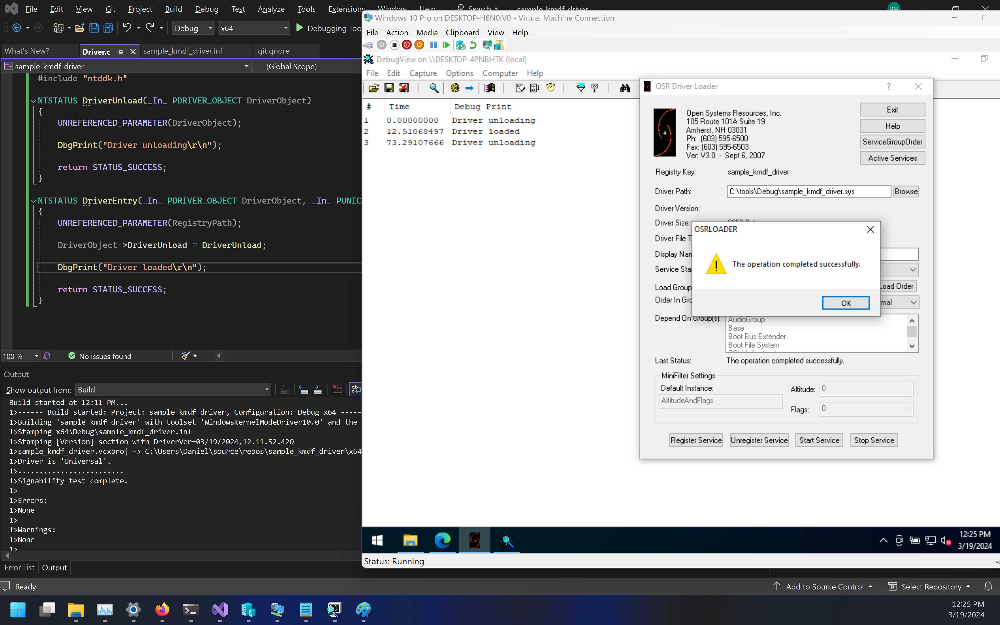
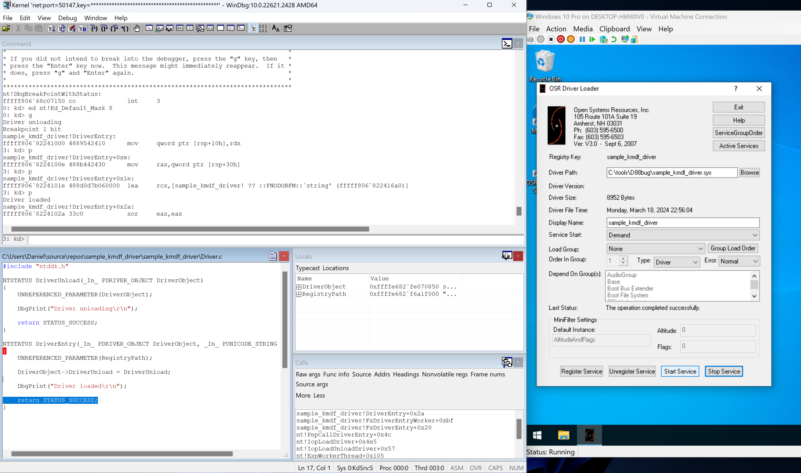

# Sample KMDF driver

Sample KMDF driver project with load and unload functionality.

# Environment setup

- Visual Studio 2022 with MSVC Spectre-mitigated libs
- WDT
- More details: https://learn.microsoft.com/en-us/windows-hardware/drivers/gettingstarted/writing-a-very-small-kmdf--driver

# Driver deployment

- Using the integrated deployment functionality from VS Studio does not work since logs mention a missing library `WDTInstall.dll`, therefore manual deployment should be performed, but setting the target machine as a provisioning should still be done as described [here](https://learn.microsoft.com/en-us/windows-hardware/drivers/gettingstarted/provision-a-target-computer-wdk-8-1).

# Driver installation

- To be performed via `OSR Driver Loader` tool.

# Debugging

- Debugging from Visual Studio doesn't work due to same reasons as for deployment.
- `WinDbg` to be used as described [here](https://learn.microsoft.com/en-us/windows-hardware/drivers/debugger/debug-universal-drivers---step-by-step-lab--echo-kernel-mode-)

## Summary commands/steps for debugging via WinDbg

- Open `WinDbg`
	- `cd "C:\Program Files (x86)\Windows Kits\10\Debuggers\x64"`
	- `.\windbg.exe -k net:port=<PORT>,key=<KEY>`
		- `KEY` and `PORT` as defined in the provisioning target setup

- Restart target machine
- Observe `WinDbg` connecting to debugee
- Break in `WinDbg` using `CTRL+ScrollLock`
- Set-up debugger
	- Enable DML
		- `.prefer_dml 1`
	- Set symbol and source path
		- `.sympath+ C:\Users\Daniel\source\repos\sample_kmdf_driver`
		- `.srcpath+ C:\Users\Daniel\source\repos\sample_kmdf_driver`
		- `.reload /f`
	- Observe modules and symbols
		- `lm`
		- `x /D sample_kmdf_driver!*`
	- Set breakpoints
		- e.g. `bm sample_kmdf_driver!DriverEntry`
	- Enable logs
		- `ed nt!Kd_Default_Mask 8`
- Exit break
	- `g`

